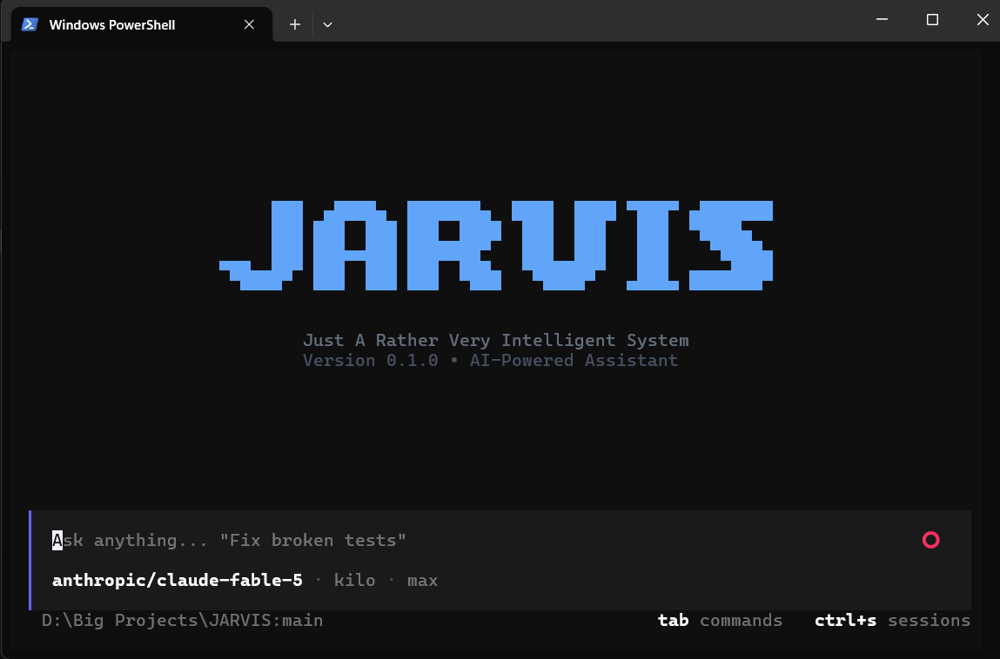

<div align="center">

<table align="center">
<tr><td align="center">

```
 ██████╗  █████╗ ██████╗ ██╗   ██╗██╗███████╗
 ╚══██╔╝ ██╔══██╗██╔══██╗██║   ██║██║██╔════╝
    ██║  ███████║██████╔╝██║   ██║██║███████╗
██  ██║  ██╔══██║██╔══██╗╚██╗ ██╔╝██║╚════██║
╚█████╔╝ ██║  ██║██║  ██║ ╚████╔╝ ██║███████║
 ╚════╝  ╚═╝  ╚═╝╚═╝  ╚═╝  ╚═══╝  ╚═╝╚══════╝
```

</td></tr>
</table>

<p align="center"><b>Just A Rather Very Intelligent System</b></p>
<p align="center"><b>The ultimate open-source AI assistant. Multi-provider, MCP-powered, voice-enabled.</b></p>

<p align="center">
  <a href="https://www.python.org/downloads/"></a>
  <a href="LICENSE"></a>
  <a href="https://textual.textualize.io"></a>
  <a href="https://modelcontextprotocol.io"></a>
  <a href="https://github.com/krishcodes07/JARVIS"></a>
</p>

</div>

[](tui_preview.png)

> [!IMPORTANT]
> **Project Development Status**: Currently, **only the Terminal UI (TUI)** is active and under active development. The **Web UI** and **Desktop GUI** are currently in the development phase and are not functional yet.

---

## Why J.A.R.V.I.S.?

Most AI assistants lock you into a single provider, restrict your choice of interfaces, or hide key infrastructure behind vendor paywalls. **JARVIS gives you absolute control over your AI environment.** Query 180+ LLM providers via `models.dev` integration, interact via rich terminal TUI, extend functionality with Model Context Protocol (MCP) servers, and control everything hands-free with real-time streaming voice.

- **180+ LLM Provider Catalog (`models.dev`)** — Direct integration with 180+ LLM providers (OpenAI, Anthropic, Google Gemini, Groq, NVIDIA NIM, OpenRouter, Mistral, OpenCode, TokenRouter, Kilo, Cerebras, etc.) with automatic fallback streaming routing.
- **Full PC Control & Autonomous Desktop Automation** — End-to-end multi-step OS control, Windows UI Automation (UIA) tree inspection, dynamic application discovery, smooth mouse/keyboard simulation, and global emergency abort safety (`Ctrl+Alt+Q`).
- **Dynamic Reasoning Effort Control (`/effort`)** — Full `models.dev` catalog reasoning awareness. Configure reasoning effort (`low`, `medium`, `high`, `none`), disable thinking on configurable models while keeping inherent reasoning models running normally, with live footer badges and collapsible thought blocks.
- **Git-Checkpoint Revert & Message Actions** — Click any conversation message to copy prompt/response, re-run turns, or revert both conversation state and workspace file modifications back to that exact checkpoint.
- **Rich Terminal UI (TUI)** — Interactive Textual-powered terminal application with streaming markdown, syntax highlighting, keyboard shortcuts (`Ctrl+M` model picker, `Ctrl+S` sessions, `Ctrl+P` command palette, `Alt+V` voice mode), theme selector (`/theme`), and live context usage meters.
- **Multi-Platform Messaging Connectors** — Bi-directional bot bridges for **Telegram** and **Discord** with user/channel allowlists, bot commands (`/session`, `/new`, `/clear`, `/status`, `/help`), and standalone background service modes.
- **Specialized Skills Framework** — Modular skill packs for autonomous bug hunting, code review, fullstack coding, data analysis, deep research, and system architecture.
- **Native MCP Ecosystem & Creation** — Seamlessly integrate Gmail, Calendar, Excel, Telegram, Filesystem, Terminal, Firecrawl, and Vercel — or let JARVIS generate custom MCP servers dynamically.
- **Integrated Voice Suite** — Natural speech-to-text (STT) input and real-time streaming text-to-speech (TTS) output with hands-free conversation mode.


---

## User Interfaces & Technical Stack

| Component | Interface / Subsystem | Status | Technical Stack |
| --- | --- | --- | --- |
| **Terminal UI (TUI)** | Rich TUI Application | 🟢 **Active (In Dev)** | Python 3.11.4, Textual, Rich Markdown |
| **Desktop Automation** | Autonomous PC Control & Actuation | 🟢 **Active** | Windows UIA, PyAutoGUI, PyWinAuto, ScreenInfo, Pynput |
| **Messaging Connectors** | Telegram & Discord Bridges | 🟢 **Active** | `python-telegram-bot`, `discord.py`, Asyncio |
| **Web UI** | Web Dashboard | 🟡 *In Development (Non-functional)* | FastAPI, Uvicorn, WebSockets, Jinja2 |
| **Desktop GUI** | Desktop Window | 🟡 *In Development (Non-functional)* | CustomTkinter / PySide6, Asyncio integration |
| **Core Engine** | Orchestration & Events | 🟢 **Active** | Asyncio Event Bus, Pydantic v2 Config |
| **Skills Subsystem** | Specialized Prompt Modules | 🟢 **Active** | Structured prompts, auto-discovery runner |
| **Memory System** | Short & Long-term RAG | 🟢 **Active** | JSON session storage, ChromaDB Vector Store |
| **MCP Manager** | Protocol Integration | 🟢 **Active** | Stdio transport, MCP SDK 1.0+, NPX runners |
| **Voice Suite** | Speech Input / Output | 🟢 **Active** | Edge TTS, ElevenLabs, SpeechRecognition, `faster-whisper` |

---

## Features

- **Interactive First-Time Setup Wizard** — Interactive onboarding CLI (`python setup.py` or `python -m jarvis --setup`) with live API key testing, model validation, and offline embedding initialization.
- **OAuth 2.0 Loopback & Personal Service Auth** — Native browser OAuth 2.0 flow for Google (Gmail & Google Calendar) and Telethon MTProto authentication for personal Telegram accounts via `python main.py --connect <service>`.
- **Autonomous PC Control & Desktop Automation** — Multi-step desktop control via native tools (`app_control`, `window_control`, `browser_control`, `input_simulation`), launch & control apps, browse websites, manage window layouts, and simulate mouse/keyboard with emergency abort failsafes (`Ctrl+Alt+Q`).
- **Terminal TUI Experience** — Rich, interactive terminal interface (`python main.py`) with real-time streaming, command history, model search modal (`Ctrl+M`), provider connector (`/connect`), sessions manager (`Ctrl+S`), reasoning effort selector (`/effort`), MCP manager modal (`Ctrl+P` or `/mcp`), theme customizer (`/theme`), and voice controls (`Alt+V`).
- **Dynamic Messaging Connectors (Telegram & Discord)** — Auto-discovered messaging bridges from `jarvis/connectors` and `~/.jarvis/connectors/` with channel/user allowlists, message chunking, typing indicators, and session persistence.
- **180+ LLM Provider Backends** — Powered by the `models.dev` catalog with automatic provider protocol detection (OpenAI, Anthropic, Google Gemini) and automatic fault-tolerant fallback routing.
- **Offline & Multi-Backend Vector Memory** — ChromaDB vector memory with bundled ONNX `all-MiniLM-L6-v2` offline embeddings (zero API key needed) and automatic remote-to-local fallback.
- **Dynamic MCP Creator & Registry** — In-chat MCP tool generation and runtime server registration (`~/.jarvis/mcp/servers.json`) for npm, uvx, and python MCP servers.
- **Specialized Skills Engine** — Built-in autonomous skills for `coding`, `bug-hunting`, `code-review`, `data-analysis`, `deep-research`, `frontend-design`, `create-mcp`, and `system-architecture`.
- **Enhanced Voice Suite** — Streaming Edge TTS / ElevenLabs with automatic `<think>` tag stripping, multi-paragraph chunking, and configurable character limits (`max_speak_characters`).
- **Fully Configurable & User-Isolated** — Runtime configurations saved in `~/.jarvis/config/jarvis.yaml`, tokens in `~/.jarvis/auth/tokens.json`, and API keys in `~/.jarvis/.env`.


---

## Quick Start

### Installation

```bash
# Clone the repository
git clone https://github.com/krishcodes07/JARVIS.git
cd JARVIS

# Create & activate virtual environment
python -m venv .venv
.venv\Scripts\activate          # Windows
# source .venv/bin/activate    # Linux/Mac

# Install JARVIS core package
pip install -e .
```

### First-Time Setup Wizard (Recommended)

Run the interactive setup wizard to validate your API keys, test models, and configure embeddings:

```bash
# Run interactive setup wizard
python setup.py
# or
python -m jarvis --setup
```

The wizard will:
1. Validate your primary LLM provider key against live endpoints.
2. Verify model compatibility and reasoning support.
3. Test or download the offline local embedding model.
4. Save your configuration to `~/.jarvis/config/jarvis.yaml` and `~/.jarvis/.env`.

### Connecting Accounts & Services (OAuth & Telegram)

Authenticate personal accounts with zero manual token copying:

```bash
# Connect Google Account (Gmail & Google Calendar) via browser OAuth 2.0
python main.py --connect gmail
python main.py --connect calendar

# Connect Personal Telegram Account (MTProto User API)
python main.py --connect telegram
```

### Optional Installation Extras

Select extra dependency packages depending on your needs:

```bash
# Install PC Control & Desktop Automation dependencies
pip install -e ".[automation]"

# Install Voice dependencies (Edge TTS, ElevenLabs, SpeechRecognition, faster-whisper)
pip install -e ".[voice]"

# Install MCP server extras (openpyxl for Excel, telethon for Telegram)
pip install -e ".[mcp]"

# Install Developer & Testing tools (pytest, ruff, mypy)
pip install -e ".[dev]"

# Install ALL features at once
pip install -e ".[automation,voice,mcp,dev]"
```

---

## Running JARVIS

### 1. Terminal UI (Active Interactive Interface)

```bash
# Launch interactive TUI
python main.py
# or
python -m jarvis --ui tui

# Launch with Debug Logging
python main.py --debug
```

### 2. Standalone Messaging Connector Services

Run JARVIS as a background messaging bridge service:

```bash
# Run Telegram bot bridge
python -m jarvis --connector telegram

# Run Discord bot bridge
python -m jarvis --connector discord

# Run all enabled messaging bridges simultaneously
python -m jarvis --connector all
```

> [!NOTE]
> Web UI (`--ui web`) and Desktop GUI (`--ui gui`) flags exist in CLI but are currently under development. Please use the TUI (`--ui tui`) interface or the Messaging Connectors (`--connector <name>`).

---

## LLM Provider Architecture & Ecosystem

JARVIS features an enterprise-grade, multi-provider LLM routing architecture powered by the dynamic **[`models.dev`](https://models.dev)** catalog. With support for **180+ cloud and local LLM providers** and thousands of models, JARVIS offers universal model compatibility, native tool calling, streaming reasoning extraction, and automated fault-tolerant fallback.

### Universal Protocol Coverage

Instead of hardcoding a limited list of providers, JARVIS dynamically queries the **[`models.dev`](https://models.dev)** catalog—giving you immediate access to **180+ providers** and thousands of models. Every provider in the catalog automatically maps to one of JARVIS's three unified protocol engines:

| Protocol Engine | Ecosystem & Coverage (180+ Providers) | Tool Calling | Streaming | Reasoning Extraction (`<think>`) | Embeddings |
| --- | --- | :---: | :---: | :---: | :---: |
| **OpenAI-Compatible (`openai`)** | **170+ Providers** (OpenAI, Groq, DeepSeek, NVIDIA NIM, OpenRouter, Mistral, Together AI, xAI, Cerebras, OpenCode Zen, TokenRouter, Ollama, vLLM, LM Studio, etc.) | ✅ Native | ✅ SSE | ✅ (`reasoning_content` / `reasoning`) | ✅ `/embeddings` |
| **Anthropic (`anthropic`)** | Anthropic Claude APIs (Claude 3.5 / 3.7 Sonnet, Claude Opus 4, Claude Haiku, etc.) | ✅ Native | ✅ SSE | ✅ (`thinking` blocks) | ❌ |
| **Google Gemini (`google`)** | Google Generative AI & Vertex AI (Gemini 2.5 Pro / Flash, Gemini 2.0 Flash Thinking, etc.) | ✅ Native | ✅ SSE | ✅ (`thought: true` parts) | ✅ `/models:embedContent` |

> [!TIP]
> **Zero-Code Provider Addition**: Because JARVIS fetches provider definitions and models dynamically from `models.dev`, you can use any of the 180+ providers simply by setting its respective API key in your `.env` file or via the in-app connector (`Ctrl+A`). Custom and local endpoints (like Ollama or vLLM) can also be added via `config/providers.json` with zero Python code changes!

---

### Core Protocol Implementations

JARVIS implements three specialized protocol drivers that normalize requests, responses, streaming chunks, tool calling, and embeddings across all providers:

#### 1. OpenAI-Compatible Protocol (`OpenAIProvider`)
- **Universal Compatibility**: Serves as the universal bridge for OpenAI, Groq, NVIDIA NIM, OpenRouter, DeepSeek, Together AI, Mistral, xAI, Cerebras, OpenCode, TokenRouter, Ollama, LM Studio, and vLLM.
- **Reasoning Token Parsing**: Captures and converts provider reasoning fields (`reasoning_content` or `reasoning`) into standardized `<think>...</think>` XML blocks during both streaming and non-streaming responses.
- **Native Function Calling**: Translates Pydantic tool definitions into OpenAI function call schemas and normalizes `tool_calls` payloads.
- **Embeddings Support**: Direct integration with `/embeddings` endpoints (with automatic `input_type="passage"` injection for NVIDIA NIM models).

#### 2. Anthropic Protocol (`AnthropicProvider`)
- **Messages API**: Implements native Anthropic Messages API (`/v1/messages`) specification.
- **System Prompt Isolation**: Automatically separates system instructions into top-level `system` parameters as required by Anthropic.
- **Extended Thinking Blocks**: Accumulates `thinking_delta` and `content_block` stream chunks into formatted reasoning blocks.
- **Streaming Tool Accumulation**: Parses incremental `input_json_delta` chunks and reconstitutes valid tool invocation arguments.

#### 3. Google Gemini Protocol (`GoogleProvider`)
- **Generative AI REST API**: Direct integration with `/models/{model}:generateContent` and `/models/{model}:streamGenerateContent`.
- **Strict Schema Proto Sanitizer (`_clean_schema`)**: Automatically transforms arbitrary JSON Schemas and OpenAPI definitions into Google's strict Schema proto by removing unsupported fields (`additionalProperties`, `$schema`, `title`, `default`), normalizing `anyOf`/`oneOf` nullable types, and converting data types to uppercase (`OBJECT`, `ARRAY`, `STRING`, etc.) to prevent `400 Bad Request` API errors.
- **Flash Thinking Support**: Real-time extraction of Gemini 2.0 / 2.5 thinking tokens (`thought: true`) into `<think>` blocks.
- **Thought Signature Preservation**: Round-trips Gemini thought signatures (`thought_signature` / `thoughtSignature`) to ensure continuous function-calling reasoning chains.
- **Multi-Tool Turn Merging**: Merges multiple simultaneous tool execution outputs into a single turn with `functionResponse` parts.

---

### Key Architectural Capabilities

#### 🔄 Dynamic models.dev Catalog & Local Caching
JARVIS fetches and caches metadata for **180+ providers** and their full model rosters from [`https://models.dev/api.json`](https://models.dev/api.json). The catalog is stored locally in `~/.jarvis/workspace/cache/models_dev_cache.json` (with repository fallback in `data/models_dev_cache.json`), enabling offline boot, context limit detection, and credential field validation without manual configuration.

#### ⚡ Connected Provider Auto-Discovery & Smart Boot
At startup, JARVIS checks environment variables and `.env` files across both the repository root and `~/.jarvis/.env`. If the configured default provider does not have an active API key, JARVIS **automatically falls back to the first available connected provider**, ensuring zero-downtime startup.

#### 🔀 Seamless Runtime Provider & Model Switching
Switch providers and models on the fly with zero restarts:
- **Terminal UI Modal (`Ctrl+M`)**: Open the interactive Model Picker to search providers, inspect context window limits, and switch instantly.
- **API Key Connector Modal (`Ctrl+A`)**: Input and connect API keys directly in the TUI with automatic persistence to `~/.jarvis/.env`.
- **In-Chat Slash Commands**: Use `/models` in the TUI, Telegram, or Discord:
  ```bash
  /models switch groq llama-3.3-70b-versatile
  /models switch google gemini-2.5-flash
  /models switch anthropic claude-sonnet-4-20250514
  ```

#### 🛡️ Automated Fault-Tolerant Fallback
If your primary provider encounters rate limits, downtime, or network outages, the `ProviderManager` automatically executes a failover to the configured fallback provider and model (e.g. OpenRouter or Google Gemini) for both standard generation and real-time streaming, labeling the turn with `(fallback)` diagnostics.

#### 🧠 Universal Thinking & Reasoning Pipeline
Reasoning models (DeepSeek R1/V3/Reasoner, Claude 3.7 Sonnet, Gemini 2.5 Flash Thinking, OpenAI o-series, StepFun, etc.) are unified under an interactive collapsible `<think>...</think>` display stream. Toggle thinking on/off in `jarvis.yaml` (`thinking: false` disables reasoning options on configurable models while letting inherent only-thinking models run normally), or customize the active reasoning effort level dynamically using the `/effort` slash command or effort modal dialog.

---

### Configuration & Custom Providers

#### 1. Provider Configuration (`jarvis.yaml`)

Configure your default and fallback LLM providers in `~/.jarvis/config/jarvis.yaml` (or `config/jarvis.yaml`):

```yaml
provider:
  active: "groq"                                # Active provider identifier
  model: "llama-3.3-70b-versatile"              # Model ID
  temperature: 0.7
  max_tokens: 4096
  top_p: 1.0
  thinking: true                                # Enable reasoning/thinking tokens
  reasoning_effort: "high"                      # Reasoning effort level (none, low, medium, high, max)
  fallback:
    enabled: true
    provider: "openrouter"                      # Backup provider on primary failure
    model: "anthropic/claude-sonnet-4"          # Backup model ID
```


#### 2. Adding Custom / Local Providers (e.g., Ollama, vLLM, LM Studio)

Any OpenAI-compatible service can be registered by adding an entry to `config/providers.json` (or `~/.jarvis/config/providers.json`):

```json
{
  "name": "ollama",
  "display_name": "Ollama (Local)",
  "protocol": "openai",
  "base_url": "http://localhost:11434/v1",
  "api_key_env": "OLLAMA_API_KEY",
  "default_model": "llama3.2:latest",
  "supports": ["text", "streaming", "tools"]
}
```

Then specify the provider in your config or `.env`:
```env
OLLAMA_API_KEY=ollama
```

---

## Built-in Tools & Security Sandboxing

JARVIS includes out-of-the-box tools categorized by safety levels:

- **Desktop Control Tools**: `app_control`, `browser_control`, `window_control`, `media_control`, `system_settings`, `input_simulation`, `automate_task`
- **Basic Tools**: `calculator`, `clipboard`, `datetime_tool`, `screenshot`, `url_reader`
- **Filesystem Tools**: `read_file`, `write_file`, `edit_file`, `append_file`, `list_directory`, `make_directory`, `delete_file`, `copy_file`, `move_file`, `search_files`, `grep_search`, `get_file_info`
- **System Tools**: `process_manager`, `run_command`, `system_info`

### Permissions & Sandboxing

JARVIS enforces safety constraints when executing system commands and desktop actions:
- **Sandbox Restrictions**: Workspace isolation and blocking of dangerous shell commands.
- **Desktop Emergency Abort**: Press `Ctrl+Alt+Q` at any time to instantly freeze and abort autonomous desktop automation.
- **Protected Applications**: Automatic refusal to actuate inside sensitive windows (e.g. password managers, security prompts).

```yaml
tools:
  categories:
    desktop: true
    filesystem: true
    system: true
    basic: true
  sandbox:
    enabled: true
    workspace: "."
    blocked_commands: ["rm -rf /", "format", "shutdown"]
```

---

## MCP (Model Context Protocol) Ecosystem

JARVIS follows the standard industry architecture (like Cursor, Claude Desktop, and Cline) for Model Context Protocol:
- **Clean & Zero Overhead**: Zero pre-installed background server processes. Your context window and memory start clean and fast.
- **Dynamic Marketplace Discovery**: Integrated with **[mcpmarket.com](https://mcpmarket.com/)** and NPM/GitHub registries. Ask JARVIS to find any tool integration (`find_mcp`), and JARVIS will retrieve the command, check required API keys, and install it on the fly.
- **Interactive TUI Modal (`Ctrl+P` / `/mcp`)**: View all connected tools and resources with a clean interface.
- **1-Click Connect (`Ctrl+A`)**: Press `Ctrl+A` or `A` anywhere in the MCP modal to open the **Add MCP Server** dialog to connect servers via `npx`, `uvx`, `python`, `SSE`, or `HTTP`.
- **Specialized `find-mcp` Skill**: Guides JARVIS to autonomously search registries, inspect tool requirements, ask you for necessary credentials, and register servers.

---

## Multi-Platform Messaging Connectors

JARVIS can be deployed as a personal AI bot across chat channels with full access to tools, memory, and models:

| Platform | Connector | Configuration | Supported Features |
| --- | --- | --- | --- |
| ✈️ **Telegram** | `TelegramConnector` | `connectors.telegram.enabled: true` | Long-polling, typing action, user allowlist, slash commands |
| 👾 **Discord** | `DiscordConnector` | `connectors.discord.enabled: true` | Channel / Guild / User allowlists, typing indicator, message splitting |

### Connector In-Chat Commands
All connectors support built-in command handlers:
- `/session [id]` — Switch or view current chat session.
- `/new` — Spawn a brand new independent conversation session.
- `/clear` — Wipe session history and start clean.
- `/status` — View connector uptime, current LLM model, and system health.
- `/help` — List available connector bot commands.

---

## Specialized Skills Framework

JARVIS includes pluggable, specialized skill engines located under `src/jarvis/skills/`:

- 🐛 **`bug-hunting`** — Autonomous reproduction, root-cause debugging, hypothesis testing, and regression analysis.
- 🔍 **`code-review`** — Automated code quality, security vulnerability auditing, and adherence to design patterns.
- 💻 **`coding`** — Full-stack implementation, architecture scaffolding, refactoring, and clean code generation.
- 📊 **`data-analysis`** — Exploratory data analysis, statistical breakdowns, and data visualization planning.
- 🔬 **`deep-research`** — Recursive multi-source investigation, source synthesis, and executive briefing reports.
- 🏛️ **`system-architecture`** — High-level distributed system design, API contracts, and scalability modeling.

---

## Voice Suite & Commands

JARVIS includes a full hands-free voice suite:

- **Text-to-Speech (TTS)**: Free streaming via `edge_tts` or high-fidelity AI voices with `elevenlabs`.
- **Speech-to-Text (STT)**: `SpeechRecognition` engines (Google, Sphinx, Vosk) or local offline STT with `faster-whisper`.

### Terminal UI Slash Commands

JARVIS TUI supports rich interactive slash commands:

- `/new` — Start a new conversation session with a unique session ID.
- `/clear` — Reset conversation, delete current session, and start a fresh session (with top-right notification toast).
- `/copy` — Copy the last AI assistant response directly to system clipboard silently.
- `/effort [level]` — Open reasoning effort dialog or set reasoning level (`low`, `medium`, `high`, `none`).
- `/theme [name]` — Browse and switch UI color themes.
- `/models` — Open model selection modal or switch active LLM model.
- `/connect <provider>` — Connect model or API provider with auto-configured endpoints.
- `/sessions` — Manage and switch active conversation sessions.
- `/mcp` — Open MCP server manager modal and inspect connections.
- `/config` — View and edit active runtime configuration.
- `/debug` — Inspect system status, provider metrics, and event diagnostics.
- `/help` — Display commands overview and keybindings.
- `/exit` / `/quit` — Exit the application.

### Keyboard Shortcuts

| Shortcut | Description |
| --- | --- |
| `Ctrl+N` | Start a new conversation session |
| `Ctrl+P` / `/` | Open Slash Command Palette |
| `Ctrl+M` | Open Model Selection Modal |
| `Ctrl+S` | Open Sessions Modal |
| `Ctrl+A` | Connect Provider API Key (inside Model Modal) |
| `Alt+V` | Toggle Hands-Free Voice Mode (STT & TTS) |
| `Up` / `Down` | Navigate prompt input history |
| `Esc` | Cancel streaming generation or close active modal |
| `Ctrl+Alt+Q` | Emergency Abort desktop automation failsafe |


---

## Docker Deployment

Deploy containerized JARVIS with Docker Compose:

```bash
# Build and run Docker container
docker compose up --build
```

---

## Documentation

| Topic | Link |
| --- | --- |
| **System Architecture** | [docs/architecture.md](docs/architecture.md) |
| **Getting Started Guide** | [docs/getting_started.md](docs/getting_started.md) |
| **Configuration Reference** | [docs/configuration.md](docs/configuration.md) |
| **Adding a Provider** | [docs/guides/adding_providers.md](docs/guides/adding_providers.md) |
| **Creating Custom Tools** | [docs/guides/creating_tools.md](docs/guides/creating_tools.md) |
| **Creating MCP Servers** | [docs/guides/creating_mcp_servers.md](docs/guides/creating_mcp_servers.md) |
| **Contributing Guidelines** | [CONTRIBUTING.md](CONTRIBUTING.md) |

---

## Testing & Quality

Run the automated test suite, linter, and static type checker:

```bash
# Run pytest unit and integration tests
pytest

# Check code formatting & linting
ruff check .

# Run static type checking
mypy src/jarvis

# Build distribution package
python scripts/build.py
```

---

## License

This project is licensed under the MIT License — see the [LICENSE](LICENSE) file for details.

---

<div align="center">

*"At your service, sir."* — J.A.R.V.I.S.

</div>
