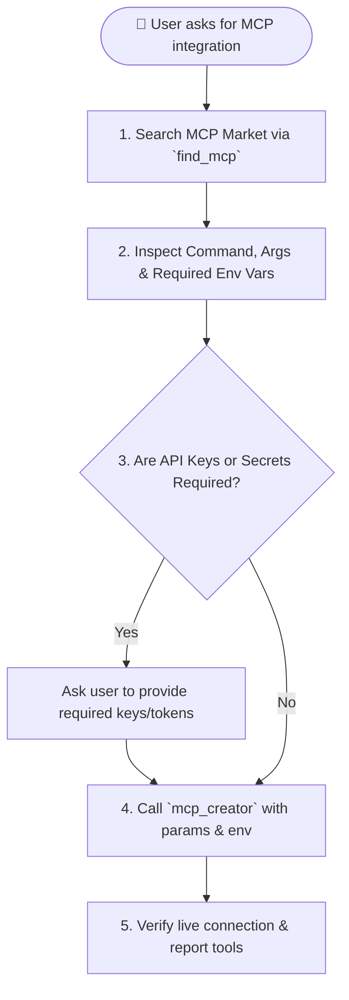

# Find MCP Skill

> Search https://mcpmarket.com/ and MCP registries for integrations, extract launch commands and environment variable requirements, ask the user for necessary credentials, and connect the server dynamically.

## Quick Summary

- **Tool for searching**: `find_mcp(query="service_name")`
- **Tool for installing**: `mcp_creator(name=..., command=..., args=..., env=...)`
- **TUI Shortcut**: `Ctrl+A` in the `/mcp` modal (`Ctrl+P`)

---
name: find-mcp
description: "Search for Model Context Protocol (MCP) servers on mcpmarket.com and online registries, inspect required parameters & API keys, prompt the user for credentials, and install/connect the server dynamically."
---

# Find & Connect MCP Servers Skill

> Search https://mcpmarket.com/ and MCP registries for integrations, extract launch commands and environment variable requirements, ask the user for necessary credentials, and connect the server dynamically.

## When to Use

Use this skill whenever:
* The user asks to find, search for, add, or install an MCP server (e.g. *"Find an MCP for Postgres"*, *"Connect GitHub MCP"*, *"Add Slack tools"*, *"Search mcpmarket for weather"*).
* The user needs an external capability (database, browser automation, cloud APIs, issue tracking) that is best served by an open-source MCP package.
* Connecting a dynamic server to `~/.jarvis/mcp/servers.json`.

---

## Procedural Workflow



### Step 1: Search MCP Market
Call the `find_mcp` tool:
```json
{
  "query": "postgres"
}
```
This queries **https://mcpmarket.com/** and the broader MCP ecosystem, returning package titles, install commands (`npx`, `uvx`, `python`), and required environment variables.

### Step 2: Check Required Environment Variables
Review the results from `find_mcp`:
* Check if the MCP server requires API keys, connection strings, or authorization tokens (e.g., `GITHUB_PERSONAL_ACCESS_TOKEN`, `POSTGRES_URL`, `SLACK_BOT_TOKEN`, `BRAVE_API_KEY`).

### Step 3: Ask User for Missing Credentials (If Needed)
If the server requires authentication:
* Politely ask the user in chat:
  > *"To connect the GitHub MCP server, I need a GitHub Personal Access Token (`GITHUB_PERSONAL_ACCESS_TOKEN`). Would you like to provide it now?"*
* If no credentials are needed (e.g., SQLite, Filesystem, Puppeteer), proceed directly to installation.

### Step 4: Call `mcp_creator`
Once parameters are ready, call `mcp_creator`:
```json
{
  "name": "github",
  "command": "npx",
  "args": ["-y", "@modelcontextprotocol/server-github"],
  "transport": "stdio",
  "description": "GitHub integration — repositories, issues, PRs",
  "env": {
    "GITHUB_PERSONAL_ACCESS_TOKEN": "ghp_..."
  },
  "auto_connect": true
}
```

### Step 5: Verify & Report Discovered Tools
* Confirm that `~/.jarvis/mcp/servers.json` was updated.
* Report the newly active tools and provide 1-2 examples of how JARVIS can use them.
