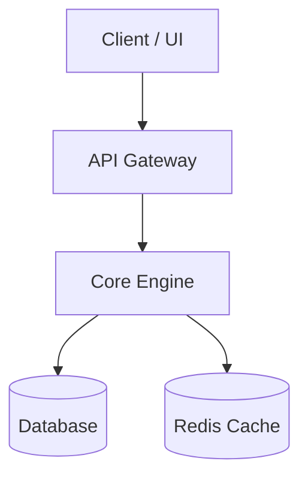

# System Architecture Skill

> Design robust, scalable, and maintainable software systems, microservices, and component boundaries with clear technical specifications.

## Overview
The `system-architecture` skill provides a framework for planning new systems, refactoring complex codebases, defining API schemas, and modeling data flows. It ensures technical decisions are well-reasoned, documented, and aligned with system constraints.

---

## When to Use
Use this skill when:
- Designing new modules, microservices, or complex features from scratch.
- Refactoring legacy monolithic components into decoupled architectures.
- Defining data storage models, message protocols, or API contracts.

---

## Required & Recommended Tools
- `read_file` / `list_directory` (to analyze existing system interfaces)
- `write_file` (to save architecture documentation, schemas, or design blueprints)

---

## Step-by-Step Execution Protocol

### Step 1: Requirement Analysis & Boundary Definition
1. Gather functional requirements, non-functional requirements (latency, throughput, availability, security), and system constraints.
2. Identify core entities, domains, and operational boundaries.

### Step 2: Component & Interface Modeling
1. Decompose the system into logical subsystems/modules.
2. Define clear interface contracts (APIs, RPCs, events) between components.
3. Choose suitable design patterns (e.g. Pub/Sub, Repository, Factory, Adapter, Pipeline).

### Step 3: Data Architecture & State Management
1. Select appropriate storage backends (Relational, Key-Value, Document, Vector DB).
2. Design database schemas, indexes, and caching strategies.
3. Map out data flow and state transitions across subsystem boundaries.

### Step 4: Trade-off & Risk Assessment
1. Evaluate architectural options against scalability, complexity, cost, and maintainability.
2. Identify single points of failure, bottleneck risks, and security boundaries.
3. Explicitly state assumptions and technical trade-offs made.

### Step 5: Blueprint Documentation
Document the architectural design using structured markdown and Mermaid diagrams:

```markdown
# Architectural Blueprint: [System Name]

## 1. Executive Summary & Goals
High-level architectural vision and goals.

## 2. System Architecture Diagram


## 3. Component Specification
- **Component A**: Role and responsibility.
- **Component B**: Role and responsibility.

## 4. Data Models & API Contracts
JSON / Python Schema definitions.

## 5. Architectural Trade-offs & Security
Discussion of trade-offs and safety controls.
```
